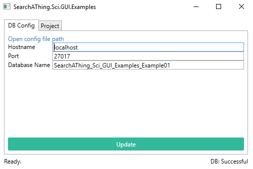
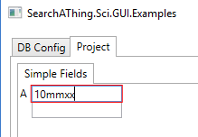

# SearchAThing.Sci.GUI.Examples

## Example01

Project data will be saved in localhost ( need mongo db server, just run a mongod from command line )

### TextMeasureConverter

Invalid measures are recognized through the converter.

