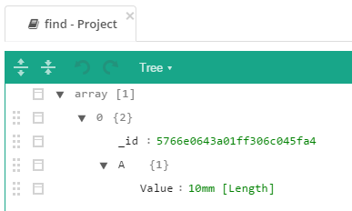

# SearchAThing.Sci.GUI.Examples

## Build

There are many dependencies between projects in relative path directly from other source repositories,
in order to build successfully its suggested to clone follow repository [SearchAThing](https://github.com/devel0/SearchAThing) containing all of them.

## Example01

Project data will be saved in localhost ( need mongo db server, just run a mongod from command line )

### TextMeasureConverter

Invalid measures are recognized through the converter.

### Mongo serialization

Serialization of the Measure.BsonValue field:

